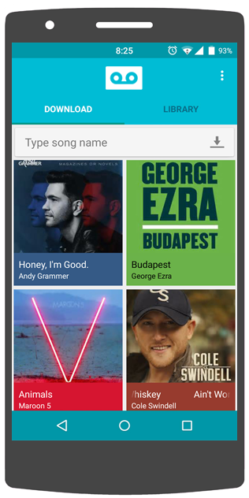

Saga only downloads the best quality music, with album art and track information embedded in every track.
Your app is always up to date with Saga's in-built updating system. You never have to download another APK.
There are no restrictions to the number of songs you can stream or download. It's free and always will be.

